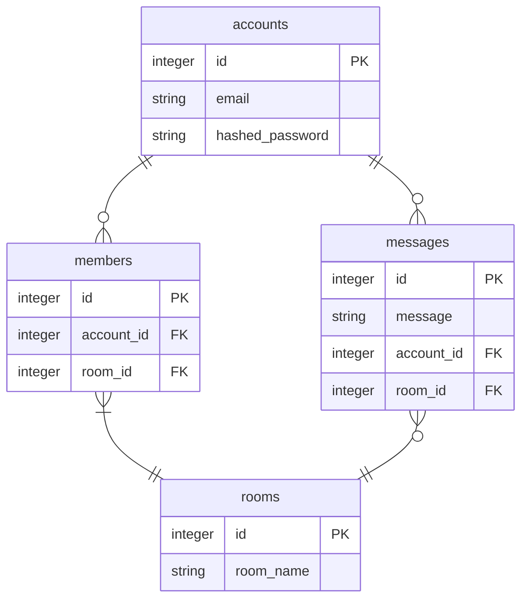

# チャットアプリ

## ER図

```mermaid
erDiagram

accounts ||--o{ members: ""
accounts ||--o{ messages: ""
members }|--|| rooms: ""
messages }o--|| rooms: ""

accounts {
  integer id PK
  string email 
  string hashed_password
}

messages {
  integer id PK
  string message
  integer account_id FK
  integer room_id FK
}

rooms {
  integer id PK
  string room_name
}

members {
  integer id PK
  integer account_id FK
  integer room_id FK
}
```

## 仕様

- アカウントはルームを作成できる
- アカウントは作成済みのルームに参加できる
- アカウントはキーワードでルームを検索できる
- アカウントは参加したルームにメッセージを送信できる
- アカウントはルームに参加しているアカウントが送信したメッセージを受け取ることができる
- ログインしていない場合はルームの一覧を閲覧できない
